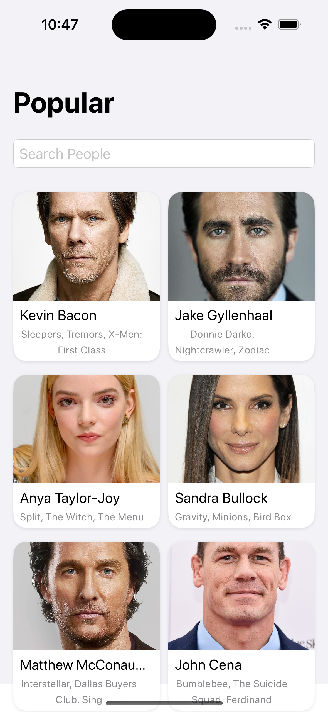
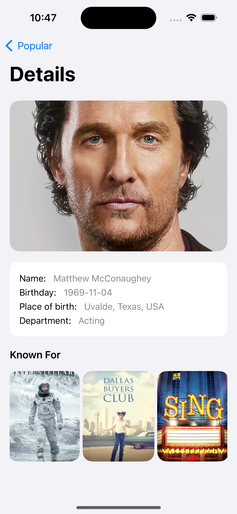
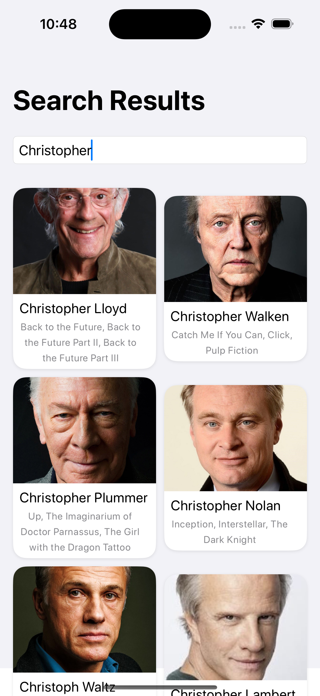

# Screen Legends

ScreenLegends is an iOS application built using **SwiftUI**, designed to fetch and display a list of popular screen legends. 
It retrieves data from [The Movie Database API](https://developer.themoviedb.org/). 
It follows the **MVVM (Model-View-ViewModel) architecture** with a feature-based folder structure for better scalability and maintainability.

## Supported Platforms
- **iOS 14 and above**

## Project Structure

```
Features
  ├── CommonComponents  # Reusable UI components
  ├── PeopleList
  │   ├── View         # SwiftUI views
  │   ├── ViewModel    # Business logic and state management
  │   ├── Model       # Data models
  ├── PeopleDetail
  │   ├── View
  │   ├── ViewModel
  │   ├── Model
  ├── Search
  │   ├── View
  │   ├── ViewModel
  │   ├── Model

Service
  ├── REST           # Networking (RESTRequest, RESTClient)
  ├── Error          # Custom error handling per feature
  ├── Configuration  # ConfigurationApi management

Resources
  ├── Screenshots          
  ├── Assets         # Colors and Icons     
  ├── MockData  
```

## Features

- Fetch and display a **list of popular people**.
- **Search functionality** to filter results dynamically.
- **Lazy loading** for efficient pagination.
- **Detailed view** for each person.
- **Custom error handling** per feature.
- **SwiftUI-based navigation** using `NavigationView`.

## Tech Stack

- **SwiftUI** → Declarative UI framework.
- **Combine** → Handles asynchronous events and data updates.
- **MVVM Architecture** → Clean separation of concerns.
- **Networking with RESTClient** → Custom API client using Combine.
- **Localized Error Handling** → Custom error enums for each feature.

## Configuration

The app requires an API key and base URL for The Movie Database (TMDb) API. These are stored in an `.xcconfig` file and accessed via the `ConfigProvider` class.

## Screenshots

### People List View


### Detail View


### Search View


## Installation
1. Clone the repository:
   ```bash
   git clone https://github.com/pranjalbhumij/ScreenLegends.git
   ```
2. Open the project in Xcode.
3. Run the app on a simulator or device.

## Future Enhancements
- Migrate from `NavigationView` to `NavigationStack` (iOS 16+).
- Implement **unit tests** for ViewModels.
- Add offline caching.
- More detailed error handling

---


